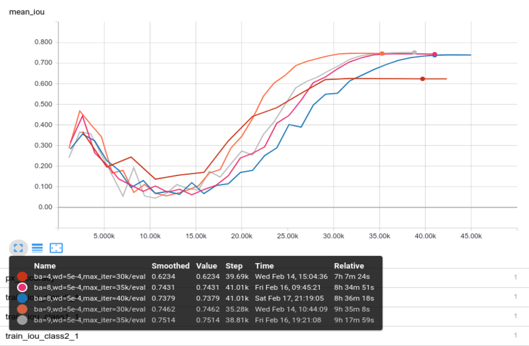
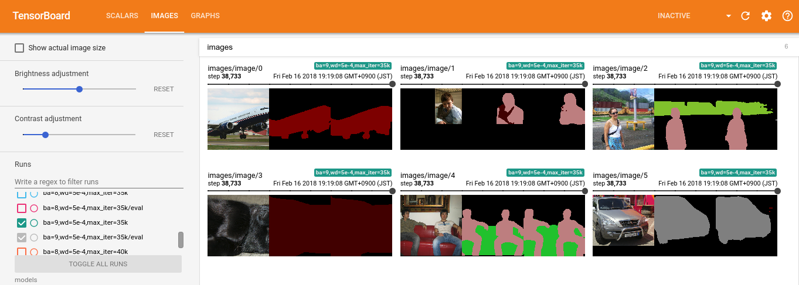

# DeepLab-v3-plus Semantic Segmentation in TensorFlow

This repo attempts to reproduce [Encoder-Decoder with Atrous Separable Convolution for Semantic Image Segmentation (DeepLabv3+)](https://arxiv.org/abs/1802.02611) in 
TensorFlow for semantic image segmentation on the
 [PASCAL VOC dataset](http://host.robots.ox.ac.uk/pascal/VOC/).
 The implementation is largely based on
 [my DeepLabv3 implementation](https://github.com/rishizek/tensorflow-deeplab-v3),
 which was originally based on
 [DrSleep's DeepLab v2 implemantation](https://github.com/DrSleep/tensorflow-deeplab-resnet)
 and [tensorflow models Resnet implementation](https://github.com/tensorflow/models/tree/master/official/resnet).
 

## Setup
Please install latest version of TensorFlow (r1.6) and use Python 3.  
- Download and extract 
[PASCAL VOC training/validation data](http://host.robots.ox.ac.uk/pascal/VOC/voc2012/VOCtrainval_11-May-2012.tar) 
(2GB tar file), specifying the location with the `--data_dir`.  
- Download and extract 
[augmented segmentation data](https://www.dropbox.com/s/oeu149j8qtbs1x0/SegmentationClassAug.zip?dl=0) 
(Thanks to DrSleep), specifying the location with `--data_dir` and `--label_data_dir`
(namely, `$data_dir/$label_data_dir`).  
- For inference the trained model with `77.31%` mIoU on the Pascal VOC 2012 validation dataset
 is available 
[here](https://www.dropbox.com/s/1xrd4c5atyrkb6z/deeplabv3plus_ver1.tar.gz?dl=0). Download and extract to 
`--model_dir`.
- For training, you need to download and extract 
[pre-trained Resnet v2 101 model](http://download.tensorflow.org/models/resnet_v2_101_2017_04_14.tar.gz)
from [slim](https://github.com/tensorflow/models/tree/master/research/slim)
specifying the location with `--pre_trained_model`.

## Training
For training model, you first need to convert original data to
the TensorFlow TFRecord format. This enables to accelerate training seep. 
```bash
python create_pascal_tf_record.py --data_dir DATA_DIR \
                                  --image_data_dir IMAGE_DATA_DIR \
                                  --label_data_dir LABEL_DATA_DIR 
```
Once you created TFrecord for PASCAL VOC training and validation deta, 
you can start training model as follow:
```bash
python train.py --model_dir MODEL_DIR --pre_trained_model PRE_TRAINED_MODEL
```
Here, `--pre_trained_model` contains the pre-trained Resnet model, whereas 
`--model_dir` contains the trained DeepLabv3+ checkpoints. 
If `--model_dir` contains the valid checkpoints, the model is trained from the 
specified checkpoint in `--model_dir`.

You can see other options with the following command:
```bash
python train.py --help
```

<p align="center">
  
</p>

The training process can be visualized with Tensor Board as follow:
```bash
tensorboard --logdir MODEL_DIR
```

<p align="center">
  

</p>

## Evaluation
To evaluate how model perform, one can use the following command:
```bash
python evaluate.py --help
```
The current best model build by this implementation achieves `77.31%` mIoU on the Pascal VOC 2012 
validation dataset. 

| Network Backbone | train OS | eval OS | SC  | mIOU paper  | mIOU repo  |
|:----------------:|:--------:|:-------:|:---:|:-----------:|:----------:|
| Resnet101        | 16       | 16      |     | 78.85%      | **77.31%** | 

Here, the above model was trained about 9.5 hours (with Tesla V100 and r1.6) with following parameters:
```bash
python train.py --train_epochs 43 --batch_size 15 --weight_decay 2e-4 --model_dir models/ba=15,wd=2e-4,max_iter=30k --max_iter 30000
```

## Inference
To apply semantic segmentation to your images, one can use the following commands:
```bash
python inference.py --data_dir DATA_DIR --infer_data_list INFER_DATA_LIST --model_dir MODEL_DIR 
```
The trained model is available [here](https://www.dropbox.com/s/1xrd4c5atyrkb6z/deeplabv3plus_ver1.tar.gz?dl=0).
One can find the detailed explanation of mask such as meaning of color in 
[DrSleep's repo](https://github.com/DrSleep/tensorflow-deeplab-resnet).

## TODO:
Pull requests are welcome.
- [x] Implement Decoder
- [x] Resnet as Network Backbone
- [ ] Xception as Network Backbone
- [ ] Implement depthwise separable convolutions
- [ ] Make network more GPU memory efficient (i.e. support larger batch size)
- [ ] Multi-GPU support
- [ ] Channels first support (Apparently large performance boost on GPU)
- [ ] Model pretrained on MS-COCO
- [ ] Unit test

## Acknowledgment
This repo borrows code heavily from 
- [DrSleep's DeepLab-ResNet (DeepLabv2)](https://github.com/DrSleep/tensorflow-deeplab-resnet)
- [TensorFlow Official Models](https://github.com/tensorflow/models/tree/master/official)
- [Tensorflow Object Detection API](https://github.com/tensorflow/models/tree/master/research/object_detection)
- [TensorFlow-Slim](https://github.com/tensorflow/models/tree/master/research/slim) 
- [TensorFlow](https://github.com/tensorflow/tensorflow)
